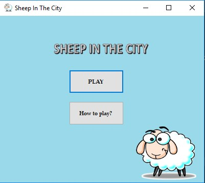
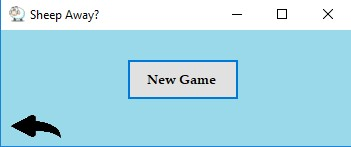
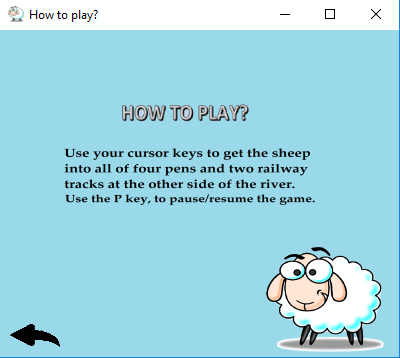
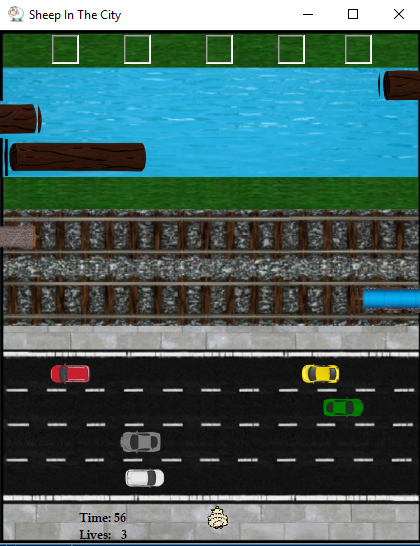
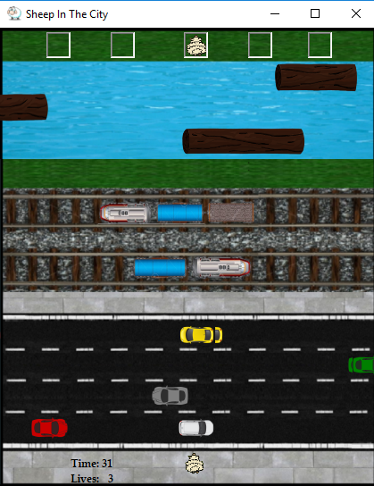
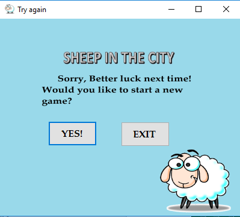
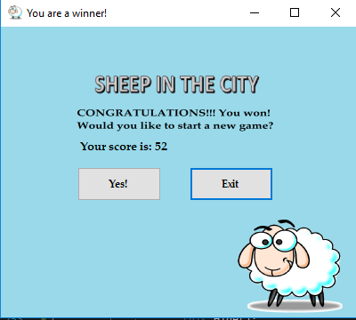

# Sheep In The City

Windows Forms Project by: Natasha Ilievska, Kristina Krajevska and Sara Spasikj.

## 1. Опис на апликацијата 
Апликацијата што ја развиваме е модификација на играта <a href="https://www.miniclip.com/games/sheepish/en/">Sheepish</a>. Sheepish е игра во која овца треба да  пристигне до другиот крај на реката пред да истече времето.<br><br>
Во нашата верзија на оваа игра идејата е иста. Модификацијата лежи во изгледот и дизајнот на играта, како и имплементацијата на зачувување на недовршена игра, паузирање на игра и водење листа на најдобри постигнати резултати.

## 2. Упатство за користење
###### *Слика 1*
  


На почетниот прозорец (Слика 1) при стартување на апликацијата има три можности: Play, How to play? и Scores.
### 2.1 Play
###### *Слика 2*



Со одбирање на првата опција - Play се отвара нов прозорец (Слика 2) каде што имаме две можности:
- New Game \- за започнување на нова игра.
- Load Game \- за продолжување на постоечка игра.

### 2.2 How to play?
###### *Слика 3*



Со одбирање на опцијата - How to play се отвара форма (Слика 3) која содржи кратко објаснување за играта и која е нејзината цел.

###### *Слика 4*




Движењето на овцата е овозможено на едноставен начин, со притискање на стрелките од тастатурата. Истата може да се движи во сите четири насоки. Целта на играта е да се однесат 5 овци, една по една, секоја соодветно сместена во некој од 5-те квадрати. Играта може да  се паузира со притискање на буквата P од тастатура. Со повторно притискање на оваа буква, играта може да се продолжи од каде што била паузирана.  


## 3. Претставување на проблемот

### 3.1 Податочни структури
Главните податоци и функции за играта се чуваат во класа public partial class FormGame : Form. 

### 3.2 Функции
#### 3.2.1 
```
private bool IsTouching(PictureBox pbSheep, PictureBox pb)
        {
            if (pbSheep.Bounds.IntersectsWith(pb.Bounds))
                return true;
            else return false;
        }
```
Оваа функција има за цел да провери дали два објекти од класата PictureBox се допираат или не. Тоа се реализира со користење на својството Control.Bounds и методата HashSet<T>.IntersectWith(IEnumerable<T>). Оваа метода проверува дали границите на pbSheep (PictureBox кој ја претставува овцата) и некој друг PictureBox (пр. автомобил, дрвена платформа) се допираат и соодветно враќа true, или  false.

### 3.2.2 
```
 private void livesDecrement() {
          
            if (countLives == 1)
            {
                timer1.Stop();
                timer2.Stop();
                timer3.Stop();
                timer4.Stop();
                this.Hide();
                formLoser = new FormLoser();
                formLoser.Show();
            }
            else {
                countLives--;
                lblLivesCount.Text = countLives.ToString();
                pbSheep.Location = startingPoint;

            }
        }
```
###### *Слика 5*


Функцијата livesDecrement() се повикува секој пат кога овцата допира објект кој претставува опасност, пречка. Функцијата има за цел да го намали бројот на животи и да ја врати овцата на почетната позиција. Доколку се потрошени сите животи се прикажува формата каде што има  две опции: 
- New Game \- за започнување на нова игра.
- Exit \- за излез од апликацијата.

## 3.3 Настани

### 3.3.1 
```
private void Form2_KeyDown(object sender, KeyEventArgs e)
```
Оваа функција е клучна за реализација на движењето на овцата. Исто така секој пат кога се повикува функцијата, се проверува дали овцата 
е пристигната и сместена во некоја од 5-те квадрати - pbEnd1, pbEnd2, pbEnd3, pbEnd4, pbEnd5. За победа на играта треба во секој од квадратите да има пренесено по една овца пред истекот на времето.

###### *Слика 6*


### 3.3.2 Timers
```
private void timer1_Tick(object sender, EventArgs e)
{
            if (!isPaused)
            {

                if (pbGreenCar.Location.X + pbGreenCar.Size.Width >= 500)
                {
                    pbGreenCar.Location = new Point(-10, pbGreenCar.Location.Y);
                }
                else pbGreenCar.Location = new Point(pbGreenCar.Location.X + 5, pbGreenCar.Location.Y);
                if (pbYellowCar.Location.X + pbYellowCar.Size.Width <= 10)
                {
                    pbYellowCar.Location = new Point(500, pbYellowCar.Location.Y);
                }
                else pbYellowCar.Location = new Point(pbYellowCar.Location.X - 10, pbYellowCar.Location.Y);
                if (pbRedCar2.Location.X + pbRedCar2.Size.Width <= 10)
                {
                    pbRedCar2.Location = new Point(500, pbRedCar2.Location.Y);
                }
                else pbRedCar2.Location = new Point(pbRedCar2.Location.X - 10, pbRedCar2.Location.Y);
                if (IsTouching(pbSheep, pbGreenCar) || IsTouching(pbSheep, pbYellowCar) || IsTouching(pbSheep, pbRedCar2))
                {
                    livesDecrement();
                }
            }
        }

```
```

private void timer2_Tick(object sender, EventArgs e)
{
        ...
         //истите проверки како во timer1_tick, но интервалот на тајмерот е различен
        ...
}

```
```
}
private void timer3_Tick(object sender, EventArgs e)
{
        ...
         //истите проверки како во timer1_tick, но интервалот на тајмерот е различен
        ...
}


```

```
private void timer4_Tick(object sender, EventArgs e)
        {
            if (!isPaused)
            {
                time--;
                lblTime.Text = string.Format("Time: {0}", time.ToString());
                if (time == 0)
                {
                    timer4.Stop();
                    this.Hide();
                    formLoser = new FormLoser();
                    formLoser.Show();
                }
                if (countSheep == 5)
                {
                    timer4.Stop();
                    this.Hide();
                    formWinner = new FormWinner();
                    formWinner.label1.Text = string.Format("Your score is: {0}", time.ToString());
                    formWinner.Show();

                }
            }
        }
        {
            if (!isPaused)
            {
                time--;
                lblTime.Text = string.Format("Time: {0}", time.ToString());
                if (time == 0)
                {
                    timer4.Stop();
                    this.Hide();
                    formLoser = new FormLoser();
                    formLoser.Show();
                }
                if (countSheep == 5)
                {
                    timer4.Stop();
                    this.Hide();
                    formWinner = new FormWinner();
                    formWinner.label1.Text = string.Format("Your score is: {0}", time.ToString());
                    formWinner.Show();

                }
            }
        }

```
Улогата на timer_Tick настаните се користат за регулирање на движењето на автомобилите, возовите и дрвените платформи односно нивната брзина на движење и поставување на граници на просторот во кој се движат. Исто така тука се повикува методот isTouching на интервали. Еден од тајмерите служи за одбројување на секундите за кои играчот треба да ја помине играта. Доколку истече времето играта се смета за завршена и нема победа во овој случај.

