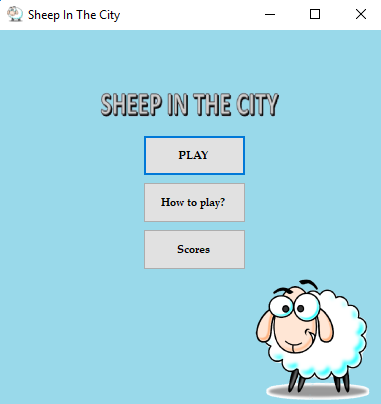
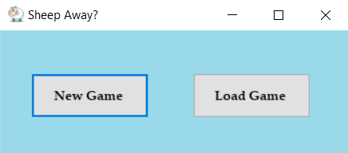

# Sheep In The City

Windows Forms Project by: Natasha Ilievska, Kristina Krajevska and Sara Spasikj.

## 1. Опис на апликацијата 
Апликацијата што ја развиваме е модификација на играта <a href="https://www.miniclip.com/games/sheepish/en/">Sheepish</a>. Sheepish е игра во која овца треба да  пристигне до другиот крај на реката пред да истече времето.  
Во нашата верзија на оваа игра идејата е иста. Модификацијата лежи во изгледот и дизајнот на играта, како и имплементацијата на зачувување на недовршена игра, паузирање на игра и водење листа на најдобри постигнати резултати.

## 2. Упатство за користење
###### *Слика 1*
  

На почетниот прозорец (Слика 1) при стартување на апликацијата има три можности: Play, How to play? и Scores.
### 2.1 Play
###### *Слика 2*

Со одбирање на првата опција - Play се отвара нов прозорец (Слика 2) каде што имаме две можности:
- New Game \- за започнување на нова игра.
- Load Game \- за продолжување на постоечка игра.

### 2.2 How to play?
### 2.3 Scores
